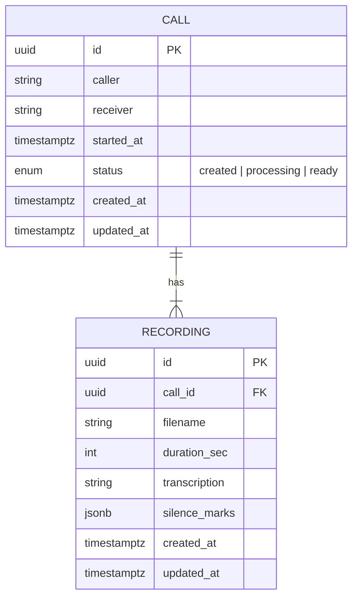

<div align="center">

# Calls Service — микросервис обработки звонков

Управление звонками и записями: приём метаданных, загрузка аудио (WAV/MP3), асинхронная обработка (длительность, псевдотранскрипт, «тишина»), хранение в Postgres, маршрутизация через FastAPI и Celery.

<br>

— Проект для быстрого знакомства с современным Python-стеком: FastAPI · SQLAlchemy async · Alembic · Celery · Redis · Docker —

</div>


> Подробная документация: см. `docs/PROJECT_GUIDE.md` — архитектура, модель данных, конфигурация, жизненный цикл, API, обработка аудио, отладка и roadmap.


## 1. Что это и зачем
Сервис принимает информацию о звонках, позволяет загрузить запись разговора и обрабатывает её в фоне (воркером), чтобы получить базовые метаданные. Это демонстрирует:
- чистую асинхронную архитектуру (FastAPI + SQLAlchemy async),
- фоновые задачи (Celery + Redis),
- миграции БД (Alembic),
- контейнеризацию и локальный запуск (Docker Compose),
- аккуратную работу с DTO, чтобы избежать проблем lazy-loading в async ORM.


## 2. Ключевая ценность для бизнеса
- Оцифровка звонков: длительность и «тепловая» карта тишины — основа для аналитики качества.
- Расширяемость: можно подключить настоящую транскрипцию (ASR), поиск по тексту, хранение в S3.
- Надёжная схема: статусы звонка (created → processing → ready) и атомарные операции.


## 3. Технологический стек
- Язык/рантайм: Python 3.12
- Веб: FastAPI, Uvicorn
- БД: PostgreSQL 16, SQLAlchemy 2.x (async), Alembic
- Очередь: Celery 5.x, Redis 7
- Аудио: pydub + ffmpeg
- Конфигурация: Pydantic v2, pydantic-settings
- Контейнеры: Docker, Docker Compose
- Опционально: S3/MinIO (boto3) для presigned URL


## 4. Архитектура (высокоуровнево)

```mermaid
flowchart LR
  subgraph Client
    C1[POST /calls]
    C2[POST /calls/{id}/recording]
    C3[GET /calls/{id}]
    C4[GET /calls?query]
    C5[GET /calls/{id}/download]
  end

  C1 --> API
  C2 --> API
  C3 --> API
  C4 --> API
  C5 --> API

  subgraph Backend
    API[FastAPI]
    CEL[Celery Worker]
    RED[Redis (broker/results)]
    DB[(PostgreSQL)]
    FS[(Recordings Volume)]
  end

  API -- SQLAlchemy async --> DB
  API -- save file --> FS
  API -- send task --> RED --> CEL
  CEL -- read file --> FS
  CEL -- update meta --> DB
```


## 5. Модель данных (упрощённо)




## 6. Эндпойнты (основные)

- POST /calls — создать звонок
- GET /calls/{id} — получить звонок по id
- POST /calls/{id}/recording — загрузить запись (multipart/form-data: file)
- GET /calls?query=...&limit=&offset= — поиск по caller/receiver
- GET /calls/{id}/download — выдать presigned URL (501, если S3 не настроен)


## 7. Быстрый старт (локально)
```bash
cp .env.example .env
docker compose up -d --build
# дождитесь healthcheck БД
docker compose exec api alembic upgrade head
```

Проверка API (curl):
```bash
# создать звонок
curl -s -X POST "http://localhost:8000/calls/" \
  -H "Content-Type: application/json" \
  -d '{"caller":"+79001234567","receiver":"+79007654321","started_at":"2025-09-27T12:00:00Z"}' | jq .

# получить по id
curl -s http://localhost:8000/calls/<uuid> | jq .

# загрузить запись
CALL_ID=<uuid>
curl -s -X POST "http://localhost:8000/calls/$CALL_ID/recording" \
  -F "file=@/path/to/sample.wav" | jq .

# проверить статус (ожидайте ready, воркер работает асинхронно)
curl -s "http://localhost:8000/calls/$CALL_ID" | jq .
```

Поиск и скачивание:
```bash
curl -s "http://localhost:8000/calls?query=+7900&limit=10&offset=0" | jq .
curl -s "http://localhost:8000/calls/$CALL_ID/download" | jq .   # 501, если S3 не настроен
```


## 8. Smoke‑тест через Python
Скрипт генерирует WAV, создаёт звонок, загружает файл и ждёт статус ready.
```bash
python3 -m pip install --user requests
python3 scripts/smoke_test.py
```
Опционально: BASE_URL=http://127.0.0.1:8000 python3 scripts/smoke_test.py


## 9. Технические акценты и практики
- Async SQLAlchemy: избегаем lazy‑load в HTTP-обработчиках — сервисы возвращают примитивные DTO.
- Состояние звонка: created → processing (при загрузке) → ready (после обработки).
- Аудио: pydub + ffmpeg; хранение файлов в volume (/recordings).
- Celery: задачі идемпотентны, с короткими CPU‑операциями; результат — запись метаданных в БД.
- Миграции: Alembic; ревизии короткие (важно для длины alembic_version).


## 10. Траблшутинг
- 404 Not Found на /calls/{id}/recording — перезапустите контейнеры (увеличили маршруты):
  - docker compose restart api worker
- 422 unsupported_extension — принимаются только .wav/.mp3
- 409 recording_already_exists — запись для звонка уже существует (one‑to‑one)
- presign_not_configured (501) — заполните S3_* в .env, если хотите presigned URL
- Ошибки воркера — смотрите логи:
  - docker compose logs -f worker


## 11. Структура репозитория (основное)
```
.
├── app/
│   ├── api/
│   │   ├── deps.py
│   │   └── routes/
│   │       ├── calls.py
│   │       └── recordings.py
│   ├── core/
│   │   ├── celery_app.py
│   │   ├── config.py
│   │   └── db.py
│   ├── models/
│   │   ├── __init__.py
│   │   ├── call.py
│   │   └── recording.py
│   ├── schemas/
│   │   └── call.py
│   ├── services/
│   │   ├── audio.py
│   │   ├── calls.py
│   │   ├── recordings.py
│   │   └── storage.py
│   └── main.py
├── migrations/
│   └── versions/
│       ├── 20250926_0001_initial.py
│       └── 20250927_0002_recording_silence_marks.py
├── scripts/
│   └── smoke_test.py
├── alembic.ini
├── docker-compose.yml
├── Dockerfile
├── pyproject.toml
├── .env.example
└── README.md
```
