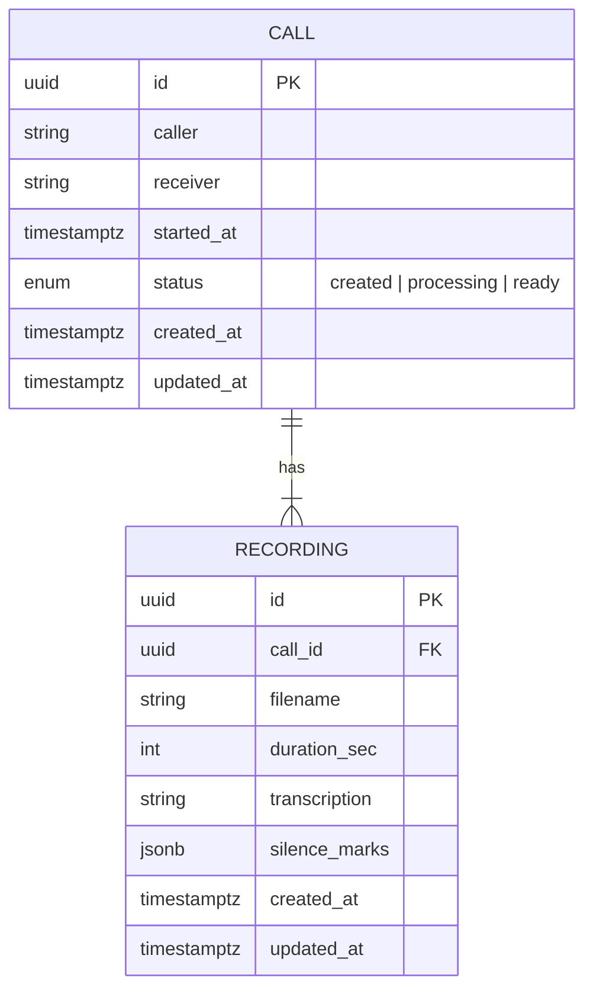

# Calls Service — Полное руководство по проекту

Это подробная документация для разработчиков и ревьюеров. Здесь описаны назначение сервиса, архитектура, модель данных, конфигурация, жизненный цикл сущностей, API, обработка аудио, деплой (локально), а также подсказки по отладке и расширению.

- Кому полезно: разработчики, архитектора, техлиды, ревьюеры.
- Что это: бекенд‑сервис для работы со звонками и аудизаписями (WAV/MP3), с фоновой обработкой аудио.

---

## 1. Назначение и ключевые сценарии

Сервис хранит звонки и их записи, обрабатывает аудио в фоновом режиме (Celery). Базовые сценарии:
- Создать запись о звонке (caller/receiver, started_at).
- Загрузить аудиофайл разговора (WAV/MP3) для звонка.
- В фоне вычислить длительность, «псевдотранскрипцию» первых 20 секунд и «метки тишины».
- Получить состояние звонка и результаты обработки.
- (Опционально) Получить presigned URL для скачивания из S3/MinIO.

Ценность: демонстрация современного Python‑стека, корректной async‑работы с ORM и очередями, и готовой основы для аналитики звонков.

---

## 2. Технологии

- Python 3.12, FastAPI, Uvicorn
- SQLAlchemy 2.x (async), Alembic, PostgreSQL 16
- Celery 5.x, Redis 7 (broker/result)
- pydub + ffmpeg (обработка аудио)
- Pydantic v2 (настройки), Docker/Docker Compose
- Опционально: boto3 (presigned URL через S3/MinIO)

---

## 3. Архитектура

Высокоуровневая схема:

```mermaid
flowchart LR
  subgraph Client
    C1[POST /calls]
    C2[POST /calls/{id}/recording]
    C3[GET /calls/{id}]
    C4[GET /calls?query]
    C5[GET /calls/{id}/download]
  end

  C1 --> API
  C2 --> API
  C3 --> API
  C4 --> API
  C5 --> API

  subgraph Backend
    API[FastAPI]
    CEL[Celery Worker]
    RED[Redis]
    DB[(PostgreSQL)]
    FS[(Recordings Volume)]
  end

  API -- SQLAlchemy async --> DB
  API -- save file --> FS
  API -- send task --> RED --> CEL
  CEL -- read file --> FS
  CEL -- update meta --> DB
```

Ключевые принципы:
- HTTP‑хендлеры не дёргают ленивые загрузки из ORM — сервисы возвращают готовые DTO.
- Состояние звонка жёстко нормализовано: created → processing → ready.
- Обработка аудио вынесена в воркер, API не блокируется.

---

## 4. Модель данных



Ревизии Alembic:
- 20250926_0001_initial — базовые таблицы.
- 20250927_0002 — добавлена колонка JSON `silence_marks`.

---

## 5. Конфигурация и переменные окружения

Файл: `app/core/config.py`, пример: `.env.example`.

Основные параметры:
- DATABASE_URL (postgresql+asyncpg)
- REDIS_URL
- RECORDINGS_DIR (путь к volume, по умолчанию `/recordings`)
- APP_ENV, APP_NAME
- (Опционно, для presign): S3_ENABLED, S3_ENDPOINT_URL, S3_ACCESS_KEY, S3_SECRET_KEY, S3_BUCKET, S3_REGION, S3_SECURE

Особенности:
- Pydantic Settings (v2), `extra="ignore"` — лишние переменные окружения не ломают старт.

---

## 6. Модули и их роль

- `app/api/routes/calls.py` — создание/получение звонков, поиск, download (presign).
- `app/api/routes/recordings.py` — загрузка аудио для звонка.
- `app/services/calls.py` — create_call, get_call, search_calls (DTO‑ориентировано).
- `app/services/recordings.py` — создание записи и обновление метаданных по завершению обработки; get_recording_by_call_id.
- `app/services/storage.py` — сохранение файла на диск; (опц.) генерация presigned URL.
- `app/services/audio.py` — pydub‑обёртки: длительность, псевдотранскрипция, «тишина».
- `app/core/celery_app.py` — инициализация Celery.
- `app/tasks.py` — `tasks.process_recording(call_id, path)` — поток обработки.
- `app/models/*` — SQLAlchemy модели.
- `app/schemas/*` — Pydantic‑схемы (DTO для API).
- `app/core/db.py` — async engine/session, declarative base.

---

## 7. Жизненный цикл

1) POST /calls → создаётся запись (status=created).
2) POST /calls/{id}/recording → файл сохраняется в volume, создаётся `recording`, статус звонка → processing; задача отправляется в Celery.
3) Worker читает файл, вычисляет duration, формирует псевдотранскрипцию 20с и «тишину», обновляет запись и переводит звонок → ready.
4) GET /calls/{id} → отражает текущее состояние (по умолчанию без инлайна recording‑деталей, чтобы не ловить lazy‑load; легко расширяется).

---

## 8. API (сводка)

- POST /calls — создать звонок
- GET /calls/{id} — получить звонок
- POST /calls/{id}/recording — загрузить .wav/.mp3 (multipart/form‑data: file)
- GET /calls?query=...&limit=&offset= — поиск по caller/receiver
- GET /calls/{id}/download — presigned URL (501, если S3 не сконфигурирован)

Коды ошибок при загрузке:
- 422 unsupported_extension — не .wav/.mp3
- 409 recording_already_exists — повторная загрузка для того же звонка

---

## 9. Обработка аудио

- Используется pydub (ffmpeg) — парсинг форматов и длительность.
- «Псевдотранскрипция» — заглушка по первым 20 сек (демо‑механика для ТЗ).
- «Тишина» — синтетические метки для демонстрации JSON‑колонки.

---

## 10. Локальный запуск и миграции

См. README для коротких команд. Вкратце:
- `docker compose up -d --build`
- `docker compose exec api alembic upgrade head`
- Проверка: curl/скрипт `scripts/smoke_test.py`

---

## 11. Отладка и типичные проблемы

- 404 на /calls/{id}/recording — перезапустить api/worker (без autoreload): `docker compose restart api worker`.
- 422 unsupported_extension — пропущено расширение .wav/.mp3.
- 409 recording_already_exists — запись на звонок уже есть (one‑to‑one).
- presign_not_configured (501) — заполните S3_* в .env.
- Логи воркера: `docker compose logs -f worker`.

---

## 12. Расширения и roadmap

- Вернуть детали записи в GET /calls/{id} (duration/transcription/silence_marks).
- Реальная транскрипция (ASR), полнотекстовый поиск.
- Выгрузка в S3 в воркере после аплоада (для корректного presign).
- Тесты (pytest) и линтинг (ruff/mypy) в CI.

---

## 13. Приложение: структура репозитория

См. README для дерева. Ключевые файлы перечислены в разделе «Модули и их роль».
